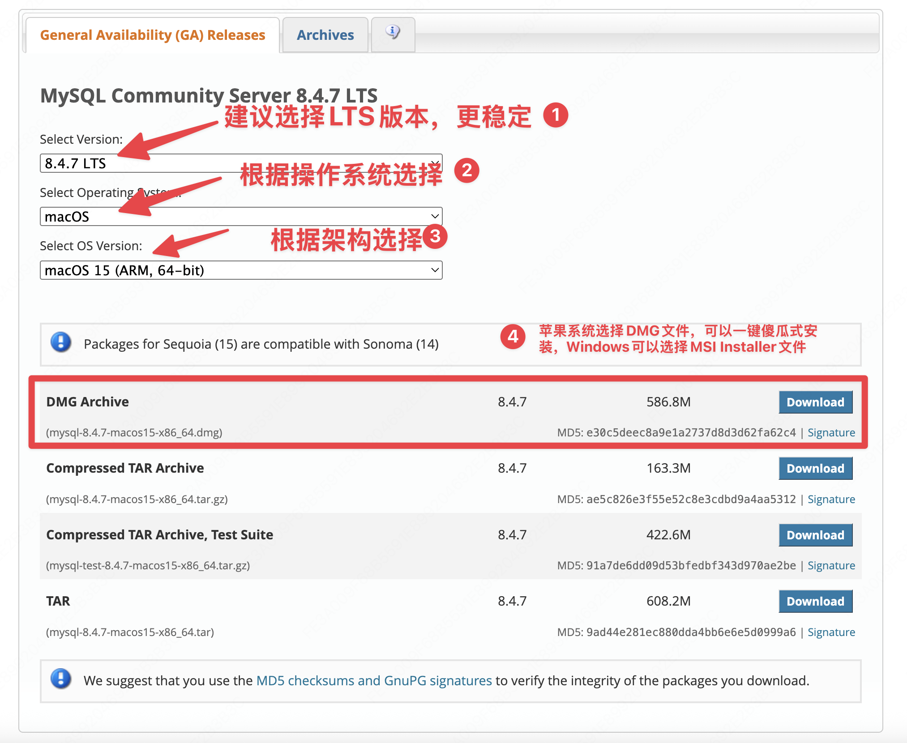
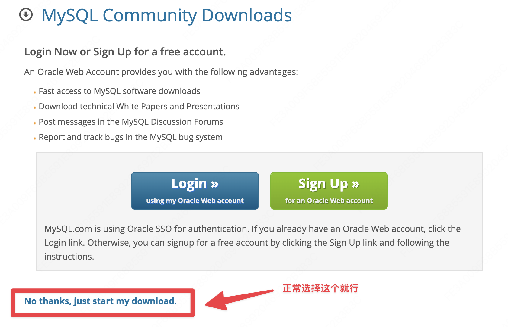

# MySQL 安装
本文档介绍安装 MySQL 的方法。
参考链接：
1. https://www.runoob.com/mysql/mysql-install.html
2. https://blog.csdn.net/guorenhao/article/details/124508441

## 确认是否已经安装好
```bash
mysql -u root -p
```
如果已经安装好，会提示输入密码，如果没有安装好，会提示 `mysql: command not found`。

## 安装地址
https://dev.mysql.com/downloads/mysql/
<details>
<summary>图解：</summary>
    


</details>

使用DMG或者MSI安装好后，`程序变量不会自动添加`，需要手动添加，添加完后即完成下载。Windows用户直接在系统UI操作，把对应的bin文件夹加在环境变量中。Mac用户操作如下：
```shell
# mac默认的终端是zsh，如果是bash的话，就选择bashrc。
# 下面这个命令执行后，进入VIM编辑器，按i进入编辑模式
sudo vim ~/.zshrc

# 在文件的末尾添加如下内容。
# 如果在下载的时候默认下载路径没变，MySQL的路径一般就是下面这个/usr/local/mysql/bin，直接复制粘贴就行
export PATH=$PATH:/usr/local/mysql/bin

# 然后按 esc 退出编辑模式，输入 :wq 保存退出
# 接着在终端执行 source ~/.zshrc 使配置生效
source ~/.zshrc
```